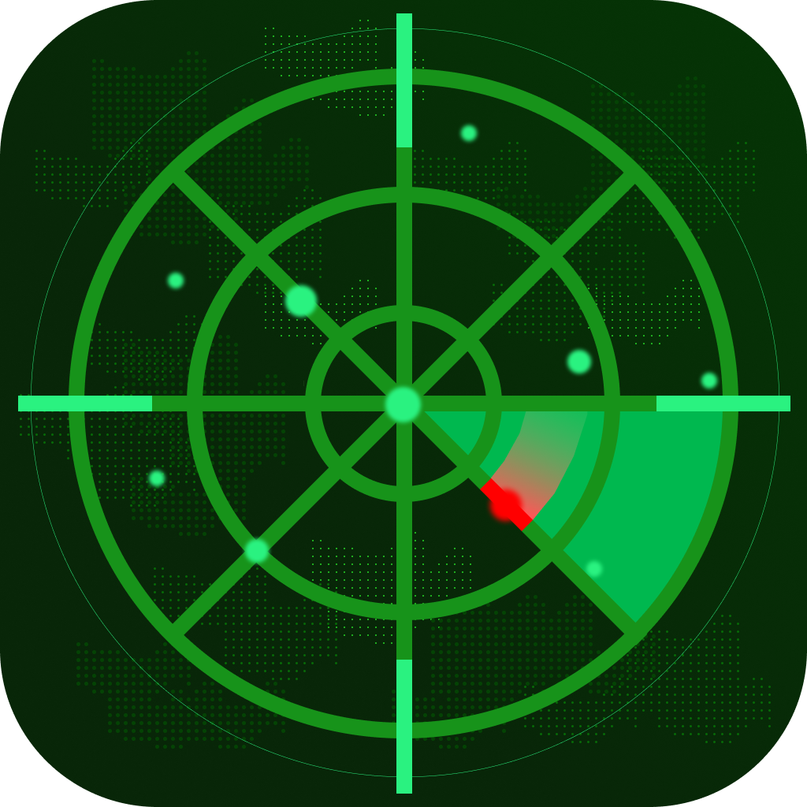

# Техническа Документация

<p align="center">
  
</p>

<p align="center">
  <em>2D и 3D визуализация на LiDAR данни в реално време за сензор MB-1R2T</em><br>
  <sub>Лого от <a href="https://github.com/PRPetkov22">PRPetkov22</a></sub>
</p>

---

## Разпределение на пиновете на LiDAR конектора


*Изображение: [pav2000/LidarStm32f103](https://github.com/pav2000/LidarStm32f103)*

---

## Съдържание

1. [Преглед на хардуера](#преглед-на-хардуера)
2. [LiDAR сензор: MB-1R2T V1.5.8](#lidar-сензор-mb-1r2t-v158)
3. [USB-към-сериен конвертор: FT232RL](#usb-към-сериен-конвертор-ft232rl)
4. [Физическа връзка и окабеляване](#физическа-връзка-и-окабеляване)
5. [Протокол за серийна комуникация](#протокол-за-серийна-комуникация)
6. [Структура на пакетите с данни](#структура-на-пакетите-с-данни)
7. [Анализ на протокола на ниво байт](#анализ-на-протокола-на-ниво-байт)
8. [Принципи на измерване на разстояние](#принципи-на-измерване-на-разстояние)
9. [Качество на сигнала и филтриране](#качество-на-сигнала-и-филтриране)
10. [Времеви характеристики и скорост на данните](#времеви-характеристики-и-скорост-на-данните)
11. [Софтуерна имплементация](#софтуерна-имплементация)
12. [2D режим на визуализация](#2d-режим-на-визуализация)
13. [3D режим на визуализация](#3d-режим-на-визуализация)
14. [Отстраняване на проблеми](#отстраняване-на-проблеми)

---

## Преглед на хардуера

Този проект свързва **китайски MB-1R2T V1.5.8** 2D LiDAR скенер с компютър чрез **FTDI FT232RL** USB-към-сериен конвертор. Системата позволява сканиране на околната среда в реално време на 360° с измерване на разстояние до 12 метра.

### Блокова схема на системата

```
┌─────────────────┐      ┌─────────────────┐      ┌─────────────────┐
│                 │      │                 │      │                 │
│   MB-1R2T       │ TTL  │    FT232RL      │ USB  │    Компютър     │
│   LiDAR         │─────▶│    Конвертор    │─────▶│    (Хост)       │
│   Сензор        │ UART │                 │      │                 │
│                 │      │                 │      │                 │
└─────────────────┘      └─────────────────┘      └─────────────────┘
     5V DC                    3.3V/5V               USB захранване
```

---

## LiDAR сензор: MB-1R2T V1.5.8

### Какво е LiDAR?

**LiDAR** (Light Detection and Ranging - Откриване и измерване чрез светлина) е технология за дистанционно отчитане, която използва лазерна светлина за измерване на разстояния. MB-1R2T е **Time-of-Flight (ToF)** базиран 2D LiDAR, който излъчва инфрачервени лазерни импулси и измерва времето, необходимо на светлината да се върне след удар в обект.

### Технически спецификации

| Параметър | Стойност |
|-----------|----------|
| Модел | MB-1R2T V1.5.8 |
| Тип | 2D 360° сканиращ LiDAR |
| Принцип на измерване | Time-of-Flight (ToF) |
| Дължина на вълната на лазера | 785-905nm (близък инфрачервен) |
| Клас на лазера | Клас 1 (безопасен за очите) |
| Обхват | 0.15m - 12m (типичен) |
| Ъглова резолюция | ~0.5° - 1° |
| Честота на сканиране | 5-10 Hz (оборота в секунда) |
| Ъглов обхват | 360° (пълно завъртане) |
| Работно напрежение | 5V DC |
| Консумация на ток | 200-400mA |
| Комуникация | UART TTL (съвместим с 3.3V/5V) |
| Скорост на предаване | 153600 bps |

### Вътрешни компоненти

MB-1R2T съдържа няколко ключови компонента:

#### 1. **Лазерен диод (TX - Предавател)**
- Излъчва кратки импулси инфрачервена светлина (785-905nm дължина на вълната)
- Продължителност на импулса: ~5-10 наносекунди
- Невидим за човешкото око, но откриваем от сензора
- Модулиран на висока честота за отхвърляне на шума

#### 2. **Фотодетектор (RX - Приемник)**  
- Лавинен фотодиод (APD) или PIN фотодиод
- Изключително чувствителен към връщащата се лазерна светлина
- Включва оптичен лентов филтър за отхвърляне на околната светлина
- Преобразува фотони в електрически сигнал

#### 3. **Въртящо се огледало/призма**
- Моторизиран въртящ механизъм (обикновено безчетков DC мотор)
- Отклонява лазерния лъч през 360°
- Енкодер проследява точната ъглова позиция
- Скорост на въртене: 5-10 оборота в секунда

#### 4. **Драйвер на мотора и управляваща верига**
- PID контролер поддържа постоянна скорост на въртене
- Генерира данни за ъглова позиция
- Синхронизира измерванията с въртенето

#### 5. **Блок за обработка на сигнала (MCU)**
- Обикновено микроконтролер от серията ARM Cortex-M
- Извършва ToF изчисления
- Обработва UART комуникацията
- Изпълнява фърмуер за форматиране на пакети

#### 6. **Управление на захранването**
- Стабилизатори на напрежение (5V към 3.3V, 1.8V)
- Верига за управление на мотора
- Верига за управление на лазера с предпазители

### Как работи Time-of-Flight

```
          t₀ (лазерът се активира)
             │
             ▼
    ┌────────────────┐
    │   LiDAR TX     │ ═══════▶ Лазерен импулс
    └────────────────┘
                              │
                              │ пътува със скоростта на светлината
                              │ c = 299,792,458 m/s
                              ▼
                        ┌──────────┐
                        │  Обект   │
                        └──────────┘
                              │
                              │ отразява се обратно
                              ▼
    ┌────────────────┐
    │   LiDAR RX     │ ◀═══════ Върнат импулс
    └────────────────┘
             │
             ▼
          t₁ (импулсът е открит)

    Разстояние = (c × Δt) / 2
    
    Където:
    - c = скорост на светлината (299,792,458 m/s)
    - Δt = t₁ - t₀ (време за двупосочно пътуване)
    - Делим на 2, защото светлината пътува до обекта И обратно
```

**Примерно изчисление:**
- Обект на 3 метра
- Двупосочно разстояние: 6 метра
- Време: 6m ÷ 299,792,458 m/s = 20.01 наносекунди
- Сензорът измерва този невероятно кратък времеви интервал!

---

## USB-към-сериен конвертор: FT232RL

### Какво е FT232RL?

**FT232RL** е USB към сериен UART интерфейсна интегрална схема, произведена от **FTDI (Future Technology Devices International)**. Тя преобразува USB сигнали в TTL-ниво UART сигнали, които LiDAR сензорът разбира.

### Технически спецификации

| Параметър | Стойност |
|-----------|----------|
| Производител | FTDI |
| Интерфейс | USB 2.0 Full Speed |
| USB скорост | 12 Mbps |
| UART скорости на предаване | 300 bps до 3 Mbps |
| Логически нива | 5V или 3.3V (конфигурируеми) |
| FIFO буфери | 128 байта TX, 256 байта RX |
| Работно напрежение | 3.3V до 5.25V |
| Ток (USB захранване) | ~15mA |

### Вътрешна архитектура

```
┌──────────────────────────────────────────────────────────────┐
│                        FT232RL                                │
│                                                               │
│  ┌─────────┐    ┌──────────────┐    ┌─────────────────────┐  │
│  │   USB   │    │   USB        │    │    UART двигател    │  │
│  │ Прием-  │───▶│   Протоколен │───▶│                     │  │
│  │ ник     │    │   двигател   │    │  Генератор на       │  │
│  │         │◀───│              │◀───│  скорост            │  │
│  └─────────┘    └──────────────┘    │  Старт/Стоп битове  │  │
│       │                              │  Форматиране        │  │
│       │              │               └─────────────────────┘  │
│       │         ┌────┴────┐             ┌─────┴─────┐        │
│       │         │  EEPROM │             │   FIFO    │        │
│       │         │  93C46  │             │  Буфери   │        │
│       │         │  Конфиг │             │ TX:128B   │        │
│       │         └─────────┘             │ RX:256B   │        │
│       │                                 └───────────┘        │
│       ▼                                       │               │
│   USB D+/D-                              TXD/RXD              │
│   (към хост)                             (към LiDAR)         │
└──────────────────────────────────────────────────────────────┘
```

### Защо FT232RL?

1. **Поддръжка на драйвери**: Вградени драйвери в macOS, Windows, Linux
2. **Надеждно времене**: Хардуерно генериране на скорост на предаване
3. **Управление на буфери**: Обработва високоскоростни данни без загуба
4. **Индустриален стандарт**: Широко използван, добре документиран

### Процес на USB изброяване

Когато включите FT232RL:

1. **USB откриване** (в рамките на 100ms)
   - Хостът открива свързване на устройството чрез промяна на напрежението на D+/D-
   - Устройството изтегля ≤100mA първоначално

2. **Изброяване** (в рамките на 2 секунди)
   - Хостът изпраща GET_DESCRIPTOR заявки
   - Устройството докладва VID=0x0403, PID=0x6001 (FTDI стандарт)
   - Хостът зарежда FTDI драйвер (вграден в модерните ОС)

3. **Конфигуриране**
   - Драйверът създава виртуален COM порт
   - macOS: `/dev/cu.usbserial-XXXXXX`
   - Windows: `COM3`, `COM4`, и т.н.
   - Linux: `/dev/ttyUSB0`

4. **Готов за комуникация**
   - Приложението отваря серийния порт
   - Задава скорост на предаване (153600 за този LiDAR)
   - Данните текат двупосочно

---

## Физическа връзка и окабеляване

### Свързване на пинове

```
MB-1R2T LiDAR          FT232RL Модул
─────────────          ──────────────
    VCC  ●────────────● VCC (5V)
    GND  ●────────────● GND
    TX   ●────────────● RX
    RX   ●────────────● TX (опционално, не се използва)

Забележка: TX/RX са кръстосани - LiDAR TX се свързва към FT232RL RX
```

### Нива на напрежение

```
TTL UART сигнални нива:

        5V ─┬─────────────────────────────┬─ Логическа ЕДИНИЦА (1)
            │                             │
            │    ████████      ████████   │
            │    █      █      █      █   │
            │    █      █      █      █   │
        0V ─┴────█──────█──────█──────█───┴─ Логическа НУЛА (0)
                 │      │      │      │
                 └──────┘      └──────┘
                 
            Старт    Битове данни   Стоп
            бит     (LSB първи)     бит
```

### Съображения за дължина на кабела

| Дължина на кабела | Качество на сигнала | Препоръка |
|-------------------|---------------------|-----------|
| < 30cm | Отлично | Идеално за прототипиране |
| 30cm - 1m | Добро | Използвайте качествен екраниран кабел |
| 1m - 3m | Влошено | Може да се наложи по-ниска скорост |
| > 3m | Лошо | Използвайте RS-485 или усилвател |

---

## Протокол за серийна комуникация

### UART конфигурация

| Параметър | Стойност | Описание |
|-----------|----------|----------|
| Скорост на предаване | 153600 bps | Битове в секунда |
| Битове данни | 8 | Размер на полезния товар на кадър |
| Стоп битове | 1 | Терминатор на кадър |
| Паритет | Няма | Без бит за проверка на грешки |
| Управление на потока | Няма | Без хардуерно ръкостискане |

### Защо 153600 бода?

Тази необичайна скорост на предаване (не "стандартна" скорост като 115200 или 230400) е избрана поради:

1. **Изисквания за пропускателна способност на данни**:
   - LiDAR произвежда ~400-600 пакета/секунда
   - Всеки пакет: ~120-150 байта средно
   - Необходима честотна лента: ~80,000 байта/секунда минимум
   - 153600 бода ≈ 15,360 байта/секунда теоретичен максимум (с overhead)
   - Реално поддържа ~14,000 байта/секунда ефективна пропускателна способност

2. **Съвместимост с честота на кристала**:
   - LiDAR MCU вероятно използва обичаен кристал (напр. 24.576 MHz)
   - 153600 = 24,576,000 ÷ 160 (чисто деление)

### Структура на UART кадър

Всеки предаден байт следва този модел:

```
     1 бит    8 бита (LSB първи)    1 бит
    ┌─────┬───────────────────────┬──────┐
    │Старт│ D0 D1 D2 D3 D4 D5 D6 D7│ Стоп │
    │  0  │        ДАННИ          │  1   │
    └─────┴───────────────────────┴──────┘
    
Общо: 10 бита на байт (8 данни + 1 старт + 1 стоп)
Ефективна скорост на данни: 153600 ÷ 10 = 15,360 байта/секунда
```

---

## Структура на пакетите с данни

### Пълен формат на пакет

MB-1R2T изпраща данни в структурирани пакети, всеки съдържащ множество измервания на разстояние:

```
┌────────────────────────────────────────────────────────────────────────┐
│                         ПЪЛЕН ПАКЕТ                                    │
├────────┬────────┬────────┬────────┬────────────┬────────────┬─────────┤
│ЗАГЛАВИЕ│ЗАГЛАВИЕ│  ТИП   │  БРОЙ  │НАЧАЛЕН ЪГЪЛ│ КРАЕН ЪГЪЛ │НЕИЗВЕСТ.│
│  0xAA  │  0x55  │  байт  │  байт  │  2 байта   │  2 байта   │ 2 байта │
├────────┴────────┴────────┴────────┴────────────┴────────────┴─────────┤
│                      ДАННИ ОТ ИЗМЕРВАНИЯ                               │
│              (БРОЙ × 3 байта на измерване)                             │
│  ┌─────────┬──────────────────────────────────────┐                   │
│  │Качество │     Разстояние (16-бит LE)           │ × БРОЙ            │
│  │ 1 байт  │     2 байта                          │                   │
│  └─────────┴──────────────────────────────────────┘                   │
└────────────────────────────────────────────────────────────────────────┘

Общ размер на пакета: 9 + (БРОЙ × 3) байта
Типичен пакет: 9 + (40 × 3) = 129 байта
```

### Разбивка байт по байт

| Отместване | Размер | Поле | Описание |
|------------|--------|------|----------|
| 0 | 1 | Заглавие 1 | Винаги `0xAA` (170 десетично) |
| 1 | 1 | Заглавие 2 | Винаги `0x55` (85 десетично) |
| 2 | 1 | Тип | Идентификатор на типа пакет |
| 3 | 1 | Брой | Брой измервания (N) |
| 4-5 | 2 | Начален ъгъл | Ъгъл × 100, Little-Endian |
| 6-7 | 2 | Краен ъгъл | Ъгъл × 100, Little-Endian |
| 8 | 2 | Резервирано | Неизвестни/контролни байтове |
| 9+ | N×3 | Данни | Тройки измервания |

### Заглавни байтове: 0xAA 0x55

Магическите байтове `0xAA 0x55` служат като **синхронизиращ модел**:

```
Двоично представяне:
0xAA = 1010 1010
0x55 = 0101 0101

Комбинирано: 1010 1010 0101 0101

Този редуващ се битов модел е:
1. Лесен за откриване в шумен поток от данни
2. Малко вероятно да се появи случайно в данните за измерване
3. Само-синхронизиращ (помага на приемника да се синхронизира)
```

### Кодиране на ъгъл

Ъглите са кодирани като 16-битови Little-Endian цели числа, представящи **ъгъл × 100** (центиградуси):

```
Пример: Ъгъл = 127.45°

Кодирана стойност = 127.45 × 100 = 12745
В шестнадесетичен: 12745 = 0x31C9

Little-Endian ред на байтове:
Байт 4 (LSB): 0xC9 = 201
Байт 5 (MSB): 0x31 = 49

Сурови байтове: C9 31

Декодиране:
(201 + 49×256) / 100 = (201 + 12544) / 100 = 127.45°
```

### Структура на данните от измерване

Всяко измерване съдържа 3 байта:

```
┌──────────────────────────────────────────────────────────────┐
│                    ИЗМЕРВАНЕ (3 байта)                       │
├────────────────┬─────────────────────────────────────────────┤
│   КАЧЕСТВО     │         РАЗСТОЯНИЕ (Little-Endian)          │
│    Байт 0      │        Байт 1 (LSB)  │  Байт 2 (MSB)        │
├────────────────┼─────────────────────────────────────────────┤
│  Сила на       │       Разстояние в милиметри                │
│  сигнала       │       Обхват: 0 - 65535mm                   │
│  (0-255)       │       (~0 - 65.5 метра)                     │
└────────────────┴─────────────────────────────────────────────┘
```

---

## Анализ на протокола на ниво байт

### Пример за реален пакет

Ето реално заловен пакет с пълен анализ:

```
Суров шестнадесетичен дъмп:
AA 55 00 28 90 6E A0 7A 00 00 47 D0 03 48 D4 03 
4A DA 03 4B E0 03 4C E6 03 4D EC 03 4E F2 03 50 
F8 03 51 FE 03 52 04 04 53 0A 04 55 10 04 56 16 
04 57 1C 04 58 22 04 59 28 04 5B 2E 04 5C 34 04 
...

Парсната структура:
┌─────────────────────────────────────────────────────────────────┐
│ Байтове 0-1:  AA 55       Заглавие (синхр. модел)               │
│ Байт 2:       00          Тип на пакета                         │
│ Байт 3:       28          Брой = 40 измервания                  │
│ Байтове 4-5:  90 6E       Начален ъгъл: 0x6E90 = 28304 → 283.04°│
│ Байтове 6-7:  A0 7A       Краен ъгъл: 0x7AA0 = 31392 → 313.92°  │
│ Байтове 8-9:  00 00       Резервирани байтове                   │
└─────────────────────────────────────────────────────────────────┘

Данни от измервания (първите 5 от 40):
┌─────┬─────────┬─────────────┬──────────────────────────────────┐
│  #  │Качество │ Раз-е (hex) │ Разстояние (декодирано)          │
├─────┼─────────┼─────────────┼──────────────────────────────────┤
│  1  │   0x47  │   D0 03     │ 0x03D0 = 976mm = 0.976m          │
│  2  │   0x48  │   D4 03     │ 0x03D4 = 980mm = 0.980m          │
│  3  │   0x4A  │   DA 03     │ 0x03DA = 986mm = 0.986m          │
│  4  │   0x4B  │   E0 03     │ 0x03E0 = 992mm = 0.992m          │
│  5  │   0x4C  │   E6 03     │ 0x03E6 = 998mm = 0.998m          │
└─────┴─────────┴─────────────┴──────────────────────────────────┘

Изчисление на ъглова стъпка:
Ъглов обхват: 313.92° - 283.04° = 30.88°
Измервания: 40
Стъпка: 30.88° / 39 = 0.792° на измерване
```

### Битово ниво анализ на стойност на разстояние

```
Пример: Разстояние = 986mm = 0x03DA

Двоична разбивка:
0x03 = 0000 0011 (MSB - Най-значим байт)
0xDA = 1101 1010 (LSB - Най-малко значим байт)

Little-Endian съхранение (LSB първи):
Памет: [DA] [03]
        │     │
        │     └── Байт на отместване+2
        └──────── Байт на отместване+1

Реконструкция на 16-битова стойност:
LSB + (MSB × 256)
= 0xDA + (0x03 × 0x100)
= 218 + 768
= 986 mm
```

### Откриване на невалидни отчитания

Определени стойности указват невалидни измервания:

```
НЕВАЛИДНИ ОТЧИТАНИЯ:
────────────────────

1. Разстояние ≥ 60000mm (0xEA60)
   - Указва: Няма върнат сигнал (обектът е твърде далеч или няма отражение)
   - Пример: 65240mm (0xFED8) - типична стойност "няма обект"
   
2. Разстояние = 0
   - Указва: Обектът е твърде близо (под минималния обхват)
   - Минимален обхват обикновено ~150mm

3. Качество ≤ 5
   - Указва: Слаб върнат сигнал, ненадеждно измерване
   - Причини: Прозрачни/тъмни обекти, екстремни ъгли
   
Често срещани невалидни модели:
┌─────────────┬────────────┬──────────────────────────┐
│ Качество    │ Разстояние │ Интерпретация            │
├─────────────┼────────────┼──────────────────────────┤
│ 0x01 (1)    │ 0xFA00     │ Няма открит обект        │
│ 0x00 (0)    │ 0xFFFF     │ Грешка на сензора        │
│ 0x05 (5)    │ 0xEA60     │ Много слабо отражение    │
│ 0x02 (2)    │ 0xF0A0     │ Извън обхват             │
└─────────────┴────────────┴──────────────────────────┘
```

---

## Принципи на измерване на разстояние

### Детайли на Time-of-Flight изчислението

```
Физически константи:
────────────────────
Скорост на светлината (c): 299,792,458 m/s
                           ≈ 0.2998 m/ns (метри на наносекунда)
                           ≈ 0.2998 mm/ps (милиметри на пикосекунда)

Необходима времева резолюция:
─────────────────────────────
За точност от 1mm:
Двупосочно разстояние: 2mm
Време = 2mm ÷ 299,792,458,000 mm/s
      = 6.67 пикосекунди

Сензорът трябва да измерва времеви интервали от ~7 пикосекунди!
Това се постига с помощта на специализирани Time-to-Digital Converters (TDC).
```

### Процес на измерване

```
    Време ─────────────────────────────────────────────────────▶

    ┌───┐
    │TX │ Лазерен импулс изстрелян в t₀
    └─┬─┘
      │
      └──── Фотони пътуват навън ────▶ ●●●●●●●●●●●●●●●●●●●●●●
                                                              │
                                                    ┌─────────┴───┐
                                                    │   Целеви    │
                                                    │   обект     │
                                                    └─────────┬───┘
                                                              │
           ◀──── Фотони се връщат ──── ●●●●●●●●●●●●●●●●●●●●●●──┘
      │
    ┌─┴─┐
    │RX │ Върнат импулс открит в t₁
    └───┘

    Измерване:
    Δt = t₁ - t₀
    Разстояние = (c × Δt) / 2
```

### Източници на грешка

| Източник на грешка | Величина | Смекчаване |
|--------------------|----------|------------|
| Трептене на часовника | ±1-5mm | Висококачествен кристал, осредняване |
| Температурен дрейф | ±2mm/°C | Вътрешна компенсация |
| Отразяемост на целта | ±1-10mm | Филтриране базирано на качество |
| Многопътно отражение | Променливо | Обработка на сигнала |
| Атмосферни условия | <0.1mm/m | Обикновено незначително |

---

## Качество на сигнала и филтриране

### Интерпретация на стойността за качество

Байтът за качество (0-255) представлява съотношението сигнал-шум на връщането:

```
Обхвати на качество:
────────────────────

  0-5:    ████░░░░░░░░░░░░░░░░  Много лошо - Отхвърли
  6-30:   ████████░░░░░░░░░░░░  Лошо - Използвай с внимание
 31-80:   ████████████░░░░░░░░  Задоволително - Приемливо
 81-150:  ████████████████░░░░  Добро - Надеждно
151-200:  ████████████████████  Отлично - Висока увереност
201-255:  ████████████████████  Максимум - Ретрорефлектор или близък обект

Фактори, влияещи на качеството:
┌──────────────────────┬───────────────────────────────────┐
│ Фактор               │ Ефект върху качеството            │
├──────────────────────┼───────────────────────────────────┤
│ Разстояние           │ Намалява с разстояние (1/r²)      │
│ Цвят на повърхност   │ Тъмни повърхности = по-ниско      │
│ Ъгъл на повърхност   │ Плътъшки ъгли = по-ниско качество │
│ Материал             │ Матово > Лъскаво > Прозрачно      │
│ Околна светлина      │ Слънцето намалява качеството      │
│ Ретрорефлектор       │ Много високо качество (>200)      │
└──────────────────────┴───────────────────────────────────┘
```

### Препоръчителна стратегия за филтриране

**Важно откритие:** Чрез обратно инженерство установихме, че сензорът MB-1R2T
редува валидни и невалидни отчитания. Всяко второ измерване има quality=1 с
разстояния от 64000-65240mm — това са сигнални стойности „без връщане", НЕ реални
измервания. Оригиналният праг `distance < 60000` беше **грешен** и пропускаше
тези фалшиви стойности, причинявайки разпръснати шумови точки при визуализацията.

Правилните прагове са:
- **Качество >= 10** (не 5 — стойности 1-9 са почти винаги невалидни)
- **Разстояние < 16000mm** (не 60000 — реалният макс. обхват на сензора е ~12m)
- **Разстояние > 50mm** (минимално надеждно разстояние)

```python
MIN_QUALITY = 10
INVALID_DISTANCE = 16000

def is_valid_measurement(quality, distance):
    if quality < MIN_QUALITY:
        return False
    if distance >= INVALID_DISTANCE:
        return False
    if distance <= 50:
        return False
    return True
```

---

## Времеви характеристики и скорост на данните

### Анализ на потока от данни

```
Скорост на въртене на LiDAR: ~7 Hz (7 оборота в секунда)
Измервания на оборот: ~500-720 точки (0.5°-1° резолюция)
Измервания в секунда: ~3500-5000 точки

Статистика на пакетите:
───────────────────────
Пакети на оборот: ~12-18
Измервания на пакет: 30-40 (типично)
Пакети в секунда: ~100-150
Байтове на пакет: ~100-130
Общ дебит на данни: ~12,000-18,000 байта/секунда

Използване на серийния порт:
────────────────────────────
Скорост: 153600 bps
Макс пропускателна способност: ~15,360 байта/секунда
Типично използване: ~80-90% от капацитета
```

### Времева диаграма

```
Време (ms)
0    10   20   30   40   50   60   70   80   90   100  110  120  130  140
│    │    │    │    │    │    │    │    │    │    │    │    │    │    │
├────┴────┴────┴────┴────┴────┴────┴────┴────┴────┴────┴────┴────┴────┤
│                    Един оборот на LiDAR (~143ms при 7Hz)             │
├──────────────────────────────────────────────────────────────────────┤

Пакети по време на оборота:
│▓▓│  │▓▓│  │▓▓│  │▓▓│  │▓▓│  │▓▓│  │▓▓│  │▓▓│  │▓▓│  │▓▓│  │▓▓│  │▓▓│
 P1    P2    P3    P4    P5    P6    P7    P8    P9   P10   P11   P12

Всеки пакет (▓▓):
- Продължителност: ~8-10ms време за предаване
- Съдържа: ~35-40 измервания
- Покрива: ~25-30° от въртенето
```

---

## Софтуерна имплементация

Визуализаторът (`lidar_map.py`) е ядрото на проекта — приложение за показване на LiDAR
данни в реално време, изградено с **Pygame** и **PyOpenGL**, поддържащо както **2D радарен
изглед** отгоре, така и потапящ **3D перспективен изглед** с екструдирани стени. Приложението
работи при 60 FPS и е проектирано за кросплатформена употреба на macOS, Windows и Linux.

### История на разработката

Настоящият визуализатор е резултат от обширна итерация:

1. **Matplotlib** — Първи опит, замръзваше при натоварване с данни в реално време
2. **PyQtGraph + PyQt6** — Препълване на буфери, сривове след 10 секунди
3. **PyQtGraph + PyOpenGL** — Артефакти тип „паяжина", свързващи отдалечени точки през центъра
4. **Pygame (настоящ)** — Стабилен, производителен, без артефакти

Ключовият пробив беше откриването, че сензорът **редува невалидни стойности**
(quality=1, distance=64000-65240mm) между валидните данни. След прилагане на правилно
филтриране (`quality >= 10`, `distance < 16000mm`), визуализацията стана чиста и точна.

### Архитектура

```
+------------------------------------------------------------------+
|  lidar_map.py                                                    |
|                                                                  |
|  +-------------+     +-----------------------------+             |
|  | LidarSerial  |---->| LidarMap (осн. контролер)   |             |
|  |              |     |                             |             |
|  | - Сериен I/O |     | - 720-слотов скан буфер     |             |
|  | - Парсване   |     | - Цикъл на събития и вход   |             |
|  |   на пакети  |     | - Превключване 2D/3D        |             |
|  | - Управление |     +--------+--------------------+             |
|  |   на буфера  |              |                                  |
|  +-------------+     +--------v--------+   +--------v--------+   |
|                      | 2D Рендерер     |   | Lidar3DView     |   |
|                      | (Pygame 2D)     |   | (OpenGL 3D)     |   |
|                      |                 |   |                 |   |
|                      | - Мрежа         |   | - Земна равнина |   |
|                      | - Точки         |   | - Екструд. стени|   |
|                      | - Стенни сегм.  |   | - Орбитна камера|   |
|                      | - Сканиращ лъч  |   | - Кръгове обхват|   |
|                      | - HUD + Легенда |   | - Мишка контрол |   |
|                      +-----------------+   +-----------------+   |
+------------------------------------------------------------------+
```

### Зависимости

| Пакет | Предназначение | Задължителен |
|-------|----------------|--------------|
| `pyserial` | Серийна комуникация с LiDAR | Да |
| `pygame` | Управление на прозорец, 2D рендиране, цикъл на събития | Да |
| `PyOpenGL` | OpenGL биндинги за 3D визуализация | По избор (3D режим) |
| `numpy` | Числени операции | По избор |

Ако PyOpenGL не е инсталиран, приложението работи само в 2D режим.

### Дизайн на скан буфера

Скан буферът е основната структура от данни, споделена между 2D и 3D рендерерите.
Използва масив от 720 слота (резолюция 0.5° на слот), съхраняващ последното измерване
за всеки ъгъл:

```python
SCAN_SIZE = 720
scan_data = [None] * SCAN_SIZE

idx = int(angle * 2) % SCAN_SIZE  # 45.5° -> слот 91
scan_data[idx] = (distance_mm, quality, age)
```

Всеки слот съхранява наредена тройка `(разстояние_мм, качество, възраст)`, където
`възраст` проследява колко пълни оборота е старо отчитането. Точки по-стари от 3
скана се отхвърлят, осигурявайки актуална визуализация.

Откриването на пълно завъртане използва преминаване на ъгъла:

```python
if angle < 30 and self.last_angle > 330:
    self.scan_count += 1
    # Остаряване на всички точки, изтриване на по-стари от POINT_FADE_SCANS
```

### Клавишни команди

| Клавиш | Действие | Режим |
|--------|----------|-------|
| `2` | Превключване на 2D изглед | 3D → 2D |
| `3` | Превключване на 3D изглед | 2D → 3D |
| `+` / `=` | Приближаване (намаляване на обхват) | И двата |
| `-` | Отдалечаване (увеличаване на обхват) | И двата |
| `W` | Вкл./Изкл. рендиране на стени | И двата |
| `G` | Вкл./Изкл. мрежа | Само 2D |
| `R` | Нулиране на скан данни и камера | И двата |
| `F` | Вкл./Изкл. цял екран | И двата |
| `ESC` / `Q` | Изход | И двата |

### Управление с мишка (3D режим)

| Вход | Действие |
|------|----------|
| Ляв бутон + влачене | Орбита на камерата (хоризонтално/вертикално) |
| Десен бутон + влачене | Панорамиране на целта на камерата |
| Скрол нагоре | Приближаване (намаляване на разстоянието до камерата) |
| Скрол надолу | Отдалечаване (увеличаване на разстоянието до камерата) |

---

## 2D режим на визуализация

2D режимът представя класически **радарен изглед отгоре** — дисплей в полярни координати,
където LiDAR сензорът се намира в центъра, а откритите обекти се показват като точки
на измерения ъгъл и разстояние. Това е изгледът по подразбиране при стартиране.

### Компоненти на дисплея

```
┌─────────────────────────────────────────────────────────────────┐
│  ● LiDAR Map    Свързан: usbserial-A506...  │ 342 тчк│
├─────────────────────────────────────────────────────────┬───┤
│                                                     │ Л │
│            ·   · ·                                  │ Е │
│          ·         ·                                │ Г │
│        ·     ┼───── сканиращ лъч                     │ Е │
│          ·         ·                                │ Н │
│            · · · ·                                  │ Д │
│       кръгове обхват (1m, 2m, 3m...)                 │ А │
│                                                     │   │
├─────────────────────────────────────────────────────────┴───┤
│  Обхват: 6m │ +/- Увеличение │ W Стени: ВКЛ │ 3 → 3D  │
└─────────────────────────────────────────────────────────────────┘
```

#### Мрежа

Мрежата се рендира като концентрични кръгове, представящи разстояние от сензора, с
радиални линии на всеки 45° за ъглова справка. Всеки кръг е означен с разстоянието
си в метри. Мрежата се адаптира към нивото на увеличение.

#### Рендиране на точки

Всяка валидна скан точка се рисува като цветен кръг, чийто цвят показва актуалност:

| Възраст | Цвят | Размер | Значение |
|---------|------|--------|-----------|
| 0 (текущ скан) | Ярко зелено `(0, 255, 100)` | 4px | Току-що измерена |
| 1 скан стара | Средно зелено `(0, 220, 80)` | 3px | Предишен оборот |
| 2-3 скана стара | Тъмно зелено `(0, 100, 50)` | 2px | Избледняваща |
| >3 скана стара | — | — | Автоматично премахната |

Тази система на остаряване създава ефект на „фосфорен разпад" подобен на класическите
радарни екрани, давайки усещане за времева устойчивост, като същевременно дисплеят
остава актуален.

#### Преобразуване на координати (точка → екран)

Полярните координати от LiDAR (ъгъл, разстояние) се преобразуват в Декартови екранни
координати:

```python
def _angle_to_xy(self, angle_deg, distance_mm):
    rad = math.radians(angle_deg)
    x = distance_mm * math.cos(rad)
    y = distance_mm * math.sin(rad)
    return x, y

def _world_to_screen(self, x_mm, y_mm):
    sx = center_x + int(x_mm * self.zoom)
    sy = center_y - int(y_mm * self.zoom)  # Y обърнат за екранни координати
    return sx, sy
```

Факторът `zoom` се изчислява, за да запълни прозореца:

```python
usable = min(center_x, center_y) - 40  # 40px поле
self.zoom = usable / (max_range_m * 1000)
```

#### Детекция на стенни сегменти

Стените се рисуват чрез свързване на съседни скан точки, които са физически близки.
Алгоритъмът използва **разстояние в пикселно пространство** вместо световно пространство,
което естествено се адаптира към нивото на увеличение и предотвратява фалшиви връзки:

```python
for j in range(1, len(screen_points)):
    sx1, sy1, _, idx1, _ = screen_points[j - 1]
    sx2, sy2, _, idx2, _ = screen_points[j]

    # Пропусни ако ъгловата разлика е твърде голяма (> 5°)
    if idx2 - idx1 > 10:
        continue

    # Провери близост в пикселно пространство
    pixel_dist = math.sqrt((sx2-sx1)**2 + (sy2-sy1)**2)
    if pixel_dist < max(30, 150 * zoom):
        pygame.draw.line(screen, wall_color, (sx1,sy1), (sx2,sy2), 2)
```

Това предотвратява **ефекта „паяжина"** — критичният бъг в рендирането, открит в
по-ранните версии. При свързване на точки само по ъглов ред, две точки с близки ъгли,
но много различни разстояния (напр. една удря близка стена, следващата минава през
врата и удря далечна стена) генерираха линии право през центъра на дисплея.

#### Сканиращ лъч

Бледа зелена линия от центъра до ръба на текущия ъгъл на сканиране дава визуална
обратна връзка, че сензорът активно сканира. Тя се върти с мотора на LiDAR.

#### HUD (Информационен дисплей)

Горната лента показва:
- Статус на връзката (зелено = свързан, червено = не е свързан)
- Име на серийния порт
- Брой активни точки в скан буфера
- Получени точки в секунда
- Общ брой пакети
- Номер на текущото сканиращо завъртане

Долната лента показва налични клавишни комбинации и текущи настройки.

#### Легенда

Полупрозрачен overlay в горния десен ъгъл обяснява цветното кодиране:
- Свежа точка, 1-скан стара, 2-3 скана стара
- Стенен сегмент, LiDAR произход, сканиращ лъч

### Кога да използвате 2D режим

- **Картографиране на стаи и пространства** — погледът отгоре е естествената перспектива
- **Проверка на подравняването на сензора** — лесно се забелязва ако сензорът е наклонен
- **Измерване на разстояния** — кръговете на мрежата дават директни показания
- **Бърза инспекция** — по-ниска изчислителна цена, работи добре на всякакъв хардуер
- **HUD информация** — пълната статистика се показва само в 2D режим

---

## 3D режим на визуализация

3D режимът трансформира плоските 2D скан данни в потапящ **перспективен изглед** с
екструдирани стени, земна равнина и свободно орбитираща камера. Използва **PyOpenGL**
за рендиране на сцената чрез OpenGL, предоставяйки усещане за физическо пространство,
което 2D изгледът не може да даде.

Натиснете `3` за влизане в 3D режим и `2` за връщане към 2D.

### Как 3D се конструира от 2D данни

MB-1R2T е **2D LiDAR** — сканира в единична хоризонтална равнина. 3D изгледът създава
илюзия за 3D среда чрез **екструдиране** на 2D скан точките вертикално:

```
2D скан данни (отгоре):           3D екструдиран резултат:

   · · · · ·                        ┌─────────────┐
  ·           ·                     │             │
 ·             ·                    │   Стена     │  ← WALL_HEIGHT
  ·           ·                     │   (200mm)   │
   · · · · ·                        └─────────────┘
                                    ▓▓▓▓▓▓▓▓▓▓▓▓▓▓▓  ← земна равнина
```

За всяка двойка съседни скан точки, формиращи стенен сегмент (използвайки същия
алгоритъм за близост като 2D режима), се рисува **четириъгълник** (правоъгълник) от
земята (y=0) нагоре до `WALL_HEIGHT` (200 единици). Това създава плътни стенни панели.

### OpenGL конвейер за рендиране

3D рендерерът (клас `Lidar3DView`) използва фиксирания функционален конвейер на OpenGL:

1. **Изчистване** — Изчистване на цветови и дълбочинни буфери
2. **Настройка на камерата** — Позициониране чрез `gluLookAt`
3. **Земна равнина** — Голям четириъгълник при y=0 с линии на мрежа
4. **Кръгове за обхват** — Концентрични кръгове на земята (интервал 1m)
5. **Маркер за произход** — Червена точка и вертикална линия на позицията на сензора
6. **Скан точки** — Цветни точки на ниво земя
7. **Стенни четириъгълници** — Полупрозрачни екструдирани правоъгълници между съседни точки
8. **Горни ръбове на стени** — Ярки линии по горния ръб за яснота

### Система на камерата

3D камерата използва **сферичен орбитен модел**, центриран върху регулируема целева точка:

```python
cam_dist  = 8000.0   # разстояние от целта (увеличение)
cam_pitch = 35.0     # вертикален ъгъл (5° – 85°)
cam_yaw   = 45.0     # хоризонтален ъгъл (неограничено въртене)
cam_target = [0, 0, 0]  # точка на фокус (панорамируема)
```

Позицията на камерата се изчислява от сферични координати:

```python
cx = target_x + dist * cos(pitch) * cos(yaw)
cy = target_y + dist * sin(pitch)           # височина
cz = target_z + dist * cos(pitch) * sin(yaw)
```

Това дава естествено поведение на „орбита около сцената" при влачене с мишката.

### Земна равнина и мрежа

Земната равнина се простира на 15 метра във всяка посока от произхода. Тя включва:

- **Базов четириъгълник** — Тъмна полупрозрачна повърхност при y=0
- **Линии на мрежа** — На всеки 1 метър за мащабна справка
- **Кръгове за обхват** — Концентрични кръгове на интервал от 1m (съвпадащи с 2D мрежата)

### Алгоритъм за екструдиране на стени

Рендирането на стени използва същата логика за съседство като 2D стенните сегменти,
но вместо рисуване на линии, създава 3D геометрия:

```python
# За всяка двойка съседни точки, преминали теста за близост:
glBegin(GL_QUADS)
  # Долен ръб (на ниво земя)
  glVertex3f(x1, 0, z1)
  glVertex3f(x2, 0, z2)
  # Горен ръб (на височина на стена)
  glVertex3f(x2, WALL_HEIGHT, z2)
  glVertex3f(x1, WALL_HEIGHT, z1)
glEnd()
```

Стените използват алфа прозрачност (`0.5` запълване, `1.0` контур), така че
припокриващи се стени остават видими. Горният ръб е подчертан с отделна ярка линия.

### Цвят на стените по възраст

| Възраст на точката | Цвят на запълване | Значение |
|--------------------|-------------------|----------|
| 0 (текуща) | `(0, 0.9, 0.4, 0.5)` | Прясно сканирана стена |
| 1 скан стара | `(0, 0.65, 0.3, 0.5)` | Скорошна стена |
| 2+ скана стара | `(0, 0.4, 0.18, 0.5)` | Остаряваща стена |

### Използвани OpenGL функции

| Функция | Предназначение |
|---------|----------------|
| `GL_DEPTH_TEST` | Правилно припокриване на стени зад други стени |
| `GL_BLEND` | Полупрозрачни стенни панели |
| `GL_LINE_SMOOTH` | Антиалиасинг на ръбовете на контурите на стени |
| `gluPerspective` | 50° зрително поле перспективна проекция |
| `gluLookAt` | Сферично орбитно позициониране на камерата |

### Координатна система

3D изгледът използва координатна система с Y нагоре:

```
        Y (нагоре)
        │
        │
        │
        └──────── X (надясно)
       /
      /
     Z (напред)
```

- **X, Z** — Хоризонтална равнина (съответства на ъгъл + разстояние от LiDAR)
- **Y** — Вертикална ос (стените се простират от 0 до WALL_HEIGHT)
- Скан точките стоят при Y=2 (леко над земята за предотвратяване на z-fighting)

### Съображения за производителност

3D режимът използва непосредствения режим на OpenGL (`glBegin`/`glEnd`) за простота.
За до 720 точки на скан, това е повече от достатъчно при 60 FPS. Основното тесно
място е скоростта на серийните данни, не рендирането.

### Кога да използвате 3D режим

- **Пространствено разбиране** — Получете интуитивно усещане за разположението на стаята
- **Презентации и демонстрации** — По-визуално впечатляващ от изглед отгоре
- **Проверка на детекцията на стени** — Вижте дали стените изглеждат като плътни повърхности
- **Изследване от различни ъгли** — Орбитирайте за да намерите мъртви зони или отражения
- **Разбиране ограниченията на сензора** — Вижте къде свършва сканирането в една равнина

### Ограничения на 3D от 2D данни

Тъй като MB-1R2T е 2D сензор, сканиращ в единична хоризонтална равнина:

- **Няма вертикална информация** — Обекти над или под равнината на сканиране са невидими
- **Фиксирана височина на стени** — Всички стени изглеждат с еднаква височина (200 единици)
- **Няма таван/под** — Съществува само изкуствената земна равнина
- **Тънки обекти** — Обекти по-тесни от резолюцията на скана (~0.5°) могат да бъдат пропуснати
- **Стъкло и огледала** — Могат да причинят фантомни отражения или преминаване

Въпреки тези ограничения, 3D изгледът предоставя много по-интуитивно разбиране на
сканираната среда от сурови числа или дори 2D изгледа отгоре.

---

## Отстраняване на проблеми

### Често срещани проблеми

| Проблем | Симптоми | Решение |
|---------|----------|---------|
| Няма данни | Портът се отваря но няма пакети | Провери окабеляването, провери 5V захранване |
| Повредени данни | Деформирани пакети, CRC грешки | Провери скоростта (трябва да е 153600) |
| Портът е заключен | Грешка "Resource busy" | Убий други процеси, включи USB отново |
| Прекъсващо | Работи после спира | Препълване на буфер, обработвай по-бързо |
| Липсващи точки | Празнини в скана | Нормално - някои повърхности не отразяват |

### Диагностични команди

**macOS:**
```bash
# Покажи USB устройства
ls /dev/cu.usb*

# Провери USB информация
system_profiler SPUSBDataType | grep -A10 "Serial"

# Наблюдавай серийни данни (сурови)
cat /dev/cu.usbserial-* | xxd | head -100
```

**Windows:**
```powershell
# Покажи COM портове
Get-WMIObject Win32_SerialPort

# Провери device manager
devmgmt.msc
```

**Linux:**
```bash
# Покажи USB серийни устройства
ls /dev/ttyUSB*

# Провери съобщения на ядрото
dmesg | grep tty

# Наблюдавай серийни данни
cat /dev/ttyUSB0 | xxd | head -100
```

---

## Приложение А: Шестнадесетична справка

```
Често срещани стойности в пакетите:

Заглавие:   AA 55     (Маркер за начало на пакет)
Тип:        00        (Стандартен пакет за измерване)
Брой:       28        (40 измервания в hex)

Примери за ъгъл (Little-Endian):
00 00 → 0.00°
E8 03 → 10.00°     (0x03E8 = 1000 центиградуса)
D0 07 → 20.00°     (0x07D0 = 2000)
10 27 → 100.00°    (0x2710 = 10000)
20 4E → 200.00°    (0x4E20 = 20000)
30 75 → 300.00°    (0x7530 = 30000)

Примери за разстояние (Little-Endian):
E8 03 → 1000mm = 1.0m
D0 07 → 2000mm = 2.0m
10 27 → 10000mm = 10.0m

Невалидни маркери:
60 EA → 60000mm (маркер за извън обхват)
FF FF → 65535mm (няма отражение)
```

---

## Приложение Б: Справки

1. FTDI FT232R Datasheet
2. Принципи на работа на ToF LiDAR
3. Спецификация на UART протокол
4. USB 2.0 спецификация
5. MB-1R2T документация на производителя (китайски)

---

*Документация създадена за проекта за визуализация на MB-1R2T LiDAR + FT232RL*
*Последна актуализация: Февруари 2026*
